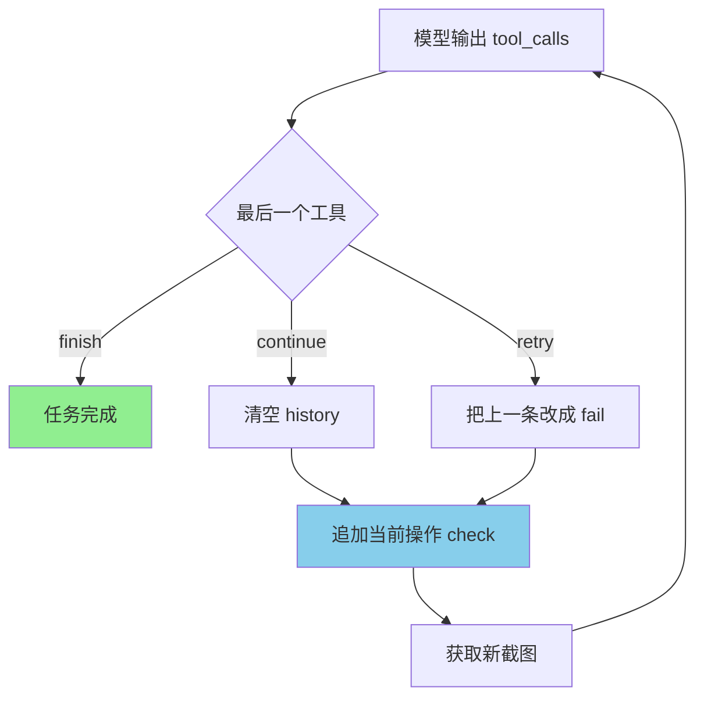
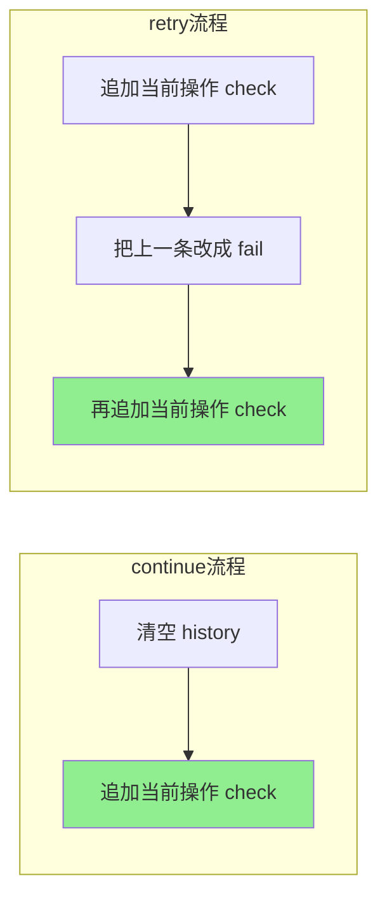
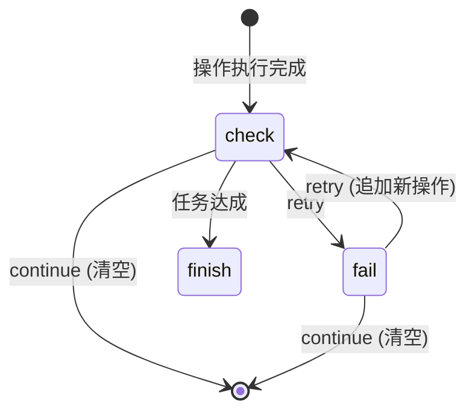

# 工具汇总

## 1. System Prompt (模型看到的系统提示词)

```
You are a desktop automation agent. You control a computer by calling tools.

IMPORTANT - Coordinate System:
- The screenshot has GRAY GRID LINES every 200 pixels
- The edges have BLACK STRIPS with WHITE TICK NUMBERS: x=0,100,...,1000 and y=0,100,...,1000
- Top-left corner shows (0,0) | Top-right shows (1000,0)
- Bottom-left shows (0,1000) | Bottom-right shows (1000,1000)
- Center red crosshair at (500, 500)
- IMPORTANT: Use the tick marks and grid lines to estimate coordinates

GRID REFERENCE SYSTEM:
- Vertical gray lines at x=0, 200, 400, 600, 800, 1000
- Horizontal gray lines at y=0, 200, 400, 600, 800, 1000

IMPORTANT RULES:
- Do NOT use move_mouse to slowly approach an element
- After EVERY action, a screenshot is automatically taken for you to verify

MULTI-TOOL CALLS:
- You can call multiple tools in one response
- Each tool will be executed in order
- A screenshot is taken after each tool execution

END STEP - You MUST end your tool calls with one of these:
1. finish() - Task is complete, stop execution
2. continue_steps(reason="...") - Task not done yet, continue to next step
3. retry(reason="...") - Previous action didn't work, retry with different approach

Example - Correct multi-tool call:
click(grid_x=500, grid_y=850)
continue_steps(reason="已点击输入框位置，现在输入文本")

Example - Complete workflow:
click(grid_x=500, grid_y=850)
type_text(text="测试新架构")
press_key(key="Enter")
continue_steps(reason="消息已发送，等待服务器响应")

When you see your goal achieved in the screenshot, call finish() immediately.
```

---

## 2. Tools Schema

### click
```
描述: 在指定坐标执行鼠标左键点击。
参数:
    grid_x: 1000x1000 网格坐标系中的 X 坐标
    grid_y: 1000x1000 网格坐标系中的 Y 坐标
输出: "[click] grid_x=500, grid_y=850 | Result: Clicked at (500, 850)"
```

### move_mouse
```
描述: 将鼠标移动到指定坐标（不点击）。
参数:
    grid_x: 1000x1000 网格坐标系中的 X 坐标
    grid_y: 1000x1000 网格坐标系中的 Y 坐标
输出: "[move_mouse] grid_x=500, grid_y=850 | Result: Moved to (500, 850)"
```

### double_click
```
描述: 在指定坐标处执行鼠标左键双击。
参数:
    grid_x: 1000x1000 网格坐标系中的 X 坐标
    grid_y: 1000x1000 网格坐标系中的 Y 坐标
输出: "[double_click] grid_x=500, grid_y=850 | Result: Double clicked at (500, 850)"
```

### right_click
```
描述: 在指定坐标处执行鼠标右键点击（通常用于打开上下文菜单）。
参数:
    grid_x: 1000x1000 网格坐标系中的 X 坐标
    grid_y: 1000x1000 网格坐标系中的 Y 坐标
输出: "[right_click] grid_x=500, grid_y=850 | Result: Right clicked at (500, 850)"
```

### scroll
```
描述: 在指定位置滚动鼠标滚轮。
参数:
    grid_x: 1000x1000 网格坐标系中的 X 坐标（鼠标位置）
    grid_y: 1000x1000 网格坐标系中的 Y 坐标（鼠标位置）
    amount: 滚动量，正数向上滚动，负数向下滚动，默认 3
输出: "[scroll] grid_x=500, grid_y=500, amount=3 | Result: Scrolled up 3 clicks at (500, 500)"
```

### drag
```
描述: 从起点坐标拖拽到终点坐标（按住左键拖动）。
参数:
    grid_x1: 起点 X 坐标
    grid_y1: 起点 Y 坐标
    grid_x2: 终点 X 坐标
    grid_y2: 终点 Y 坐标
    duration: 拖拽持续时间（秒），默认 0.5
输出: "[drag] grid_x1=100, grid_y1=100, grid_x2=300, grid_y2=300 | Result: Dragged from (100,100) to (300,300)"
```

### type_text
```
描述: 输入文本。如果提供了坐标，先点击定位再输入；如果没有坐标，假设光标已存在，直接输入。
参数:
    text: 要输入的文本内容（必填）
    grid_x: 1000x1000 网格坐标系中的 X 坐标（可选）
    grid_y: 1000x1000 网格坐标系中的 Y 坐标（可选）
输出:
    - 有坐标: "[type_text] text='hello' at (500, 600) | Result: Typed 'hello'"
    - 无坐标: "[type_text] text='hello' | Result: Typed 'hello'"
```

### press_key
```
描述: 按下指定键盘按键。
参数:
    key: 按键名称，如 "Enter", "Escape", "Tab", "Backspace", "Ctrl+A", "Ctrl+V" 等
输出: "[press_key] key='Enter' | Result: Pressed Enter"
```

### hotkey
```
描述: 按下组合键（如 Ctrl+C 全选复制）。
参数:
    keys: 组合键字符串，用逗号分隔，如 "ctrl,c" 表示 Ctrl+C
输出: "[hotkey] keys='ctrl,c' | Result: Pressed Ctrl+C"
```

### key_down
```
描述: 按住指定按键不释放（用于需要组合键的场景，如拖拽时按住 Ctrl）。
参数:
    key: 按键名称，如 "ctrl", "shift", "alt", "win" 等
输出: "[key_down] key='ctrl' | Result: Key down ctrl"
```

### key_up
```
描述: 释放之前按住的按键（与 key_down 配合使用）。
参数:
    key: 按键名称，如 "ctrl", "shift", "alt", "win" 等
输出: "[key_up] key='ctrl' | Result: Key up ctrl"
```

### wait
```
描述: 等待指定时长（秒）。
参数:
    seconds: 等待时长（秒），默认 1.0
输出: "[wait] | Result: 等待 1.0 秒完成"
```

### finish
```
描述: 标记任务已完成，代理将成功结束。
参数: 无
输出: "[finish] | Result: TASK_COMPLETED"
重要: 只有当任务目标已经完全达成时才能调用此工具。
```

### continue_steps
```
描述: 继续执行下一步操作。
参数:
    reason: 简短说明下一步要做什么
输出: "[continue_steps] reason='已点击输入框，现在输入文本' | Result: CONTINUE"
使用场景: 当前步骤成功完成，需要继续执行更多操作时调用。
```

### retry
```
描述: 重试当前操作。
参数:
    reason: 简短说明重试的原因和要调整的策略
输出: "[retry] reason='点击位置偏下，需要调整' | Result: RETRY"
使用场景: 上一步操作没有达到预期效果，需要重新尝试时调用。
```

---

## 3. 工具执行结果汇总

| 工具 | 输出 |
|------|------|
| click | "[click] grid_x=500, grid_y=850 \| Result: Clicked at (500, 850)" |
| move_mouse | "[move_mouse] grid_x=500, grid_y=850 \| Result: Moved to (500, 850)" |
| double_click | "[double_click] grid_x=500, grid_y=850 \| Result: Double clicked at (500, 850)" |
| right_click | "[right_click] grid_x=500, grid_y=850 \| Result: Right clicked at (500, 850)" |
| scroll | "[scroll] grid_x=500, grid_y=500, amount=3 \| Result: Scrolled up 3 clicks" |
| drag | "[drag] grid_x1=100, grid_y1=100, grid_x2=300, grid_y2=300 \| Result: Dragged from (100,100) to (300,300)" |
| type_text (有坐标) | "[type_text] text='hello' at (500, 600) \| Result: Typed 'hello'" |
| type_text (无坐标) | "[type_text] text='hello' \| Result: Typed 'hello'" |
| press_key | "[press_key] key='Enter' \| Result: Pressed Enter" |
| hotkey | "[hotkey] keys='ctrl,c' \| Result: Pressed Ctrl+C" |
| key_down | "[key_down] key='ctrl' \| Result: Key down ctrl" |
| key_up | "[key_up] key='ctrl' \| Result: Key up ctrl" |
| wait | "[wait] \| Result: 等待 1.0 秒完成" |
| finish | "[finish] \| Result: TASK_COMPLETED" |
| continue_steps | "[continue_steps] reason='...' \| Result: CONTINUE" |
| retry | "[retry] reason='...' \| Result: RETRY" |

---

## 4. HumanMessage 每轮发送给模型的内容

```
HumanMessage (role: user):
  content:
    - {"type": "text", "text": "Task: xxx"}
    - {"type": "image_url", "image_url": {"url": "data:image/png;base64,..."}}
    - {"type": "text", "text": "Previous result:\nreason | tool_output (status)"}
```

### Previous result 格式说明

每行格式：`reason | tool_output (status)`

- **reason**: 当前步的执行目标（描述要做什么）
- **tool_output**: 工具执行后的输出结果
- **status**: 状态标记
  - `(check)`: 当前步需要被验证
  - `(fail)`: 上一步验证失败

---

## 5. History 管理逻辑（核心机制）

### 规则

1. **continue**: 清空 history，然后追加当前操作 (check)
2. **retry**: 不清空，把上一条改成 (fail)，然后追加当前操作 (check)
3. **finish**: 任务完成

### 执行流程

```
Turn N: 模型一次输出多个工具调用
  tool1(params)
  tool2(params)
  continue_steps(reason="下一步目标") / retry(reason="重试目标") / finish()

执行顺序：
  1. 按顺序执行每个工具
  2. 每个工具执行后自动截图
  3. 处理状态工具：
     - finish → 任务完成
     - continue → 清空 history，追加当前操作 (check)
     - retry → 把上一条改成 (fail)，追加当前操作 (check)
```

---

## 6. 执行流程示例

### 成功流程

```
Turn 1: click(grid_x=500) + continue_steps(reason="点击输入框")
  → Execute click(500) → history: [点击输入框 | click(500) (check)]
  → Execute continue → 清空 history，追加 (check) → history: [点击输入框 | click(500) (check)]

Turn 2: type_text(text="测试") + continue_steps(reason="输入文本")
  → 发送给模型的 Previous result:
    点击输入框 | [click] grid_x=500 | Result: Clicked at (500) (check)
  → Execute type_text → history: [输入文本 | type_text(text) (check)]
  → Execute continue → 清空 history，追加 (check)

Turn 3: press_key(key="Enter") + finish()
  → 发送给模型的 Previous result:
    输入文本 | [type_text] text='测试' | Result: Typed '测试' (check)
  → Execute press_key
  → Execute finish → 任务完成
```

### 失败重试流程

```
Turn 1: click(grid_x=500) + continue_steps(reason="点击输入框")
  → Execute click(500)
  → Execute continue → history: [点击输入框 | click(500) (check)]

Turn 2: 模型判断位置偏下，调用 click(grid_x=480) + retry(reason="重新点击位置")
  → 发送给模型的 Previous result:
    点击输入框 | [click] grid_x=500 | Result: Clicked at (500) (check)
  → Execute click(480) → history: [重新点击位置 | click(480) (check)]
  → Execute retry → 把上一条改成 (fail)，追加当前 (check)
    history: [
      点击输入框 | click(500) (fail),
      重新点击位置 | click(480) (check)
    ]

Turn 3: 模型判断新位置正确，调用 type_text(text="测试") + continue_steps(reason="输入文本")
  → 发送给模型的 Previous result:
    点击输入框 | [click] grid_x=500 | Result: Clicked at (500) (fail)
    重新点击位置 | [click] grid_x=480 | Result: Clicked at (480) (check)
  → Execute type_text
  → Execute continue → 清空 history，追加 (check)

Turn 4: 模型调用 press_key(key="Enter") + finish()
  → 任务完成
```

---

## 7. History 管理流程图

### 整体执行流程



### continue vs retry 区别



### 状态转换图



---

## 8. 结束条件

| 情况 | 结果 |
|------|------|
| 调用 `finish()` | `success=True` |
| 最后一个不是 finish/continue/retry | `success=False` |
| 无 tool_calls | `success=False` |
| 达到最大步数 (15) | `success=False` |
